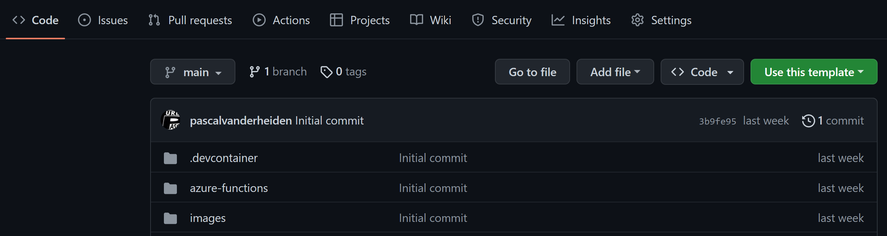
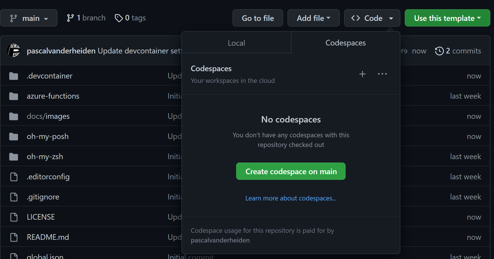

# devcontainers for Azure Integration Services #

This is the template repository that contains the devcontainer settings for Azure Integration Services development. I've added some samples for deploying the "service" components for all Azure Integration Services and the actual integration pattern. This way you can start developing your integration together with Infrastructure as Code (IaC), making it production ready! I've also included 2 GitHub Actions samples, one for building the Azure Integration Services and one for deploying the integration pattern.

## GitHub Actions Samples ##

| GitHub Action | Status |
| ----------- | ----------- |
| Build | [](https://github.com/pascalvanderheiden/ais-devcontainer-template/actions/workflows/build.yml) |
| Release | [](https://github.com/pascalvanderheiden/ais-devcontainer-template/actions/workflows/release.yml) |

## About ##

I frequently get the question: "How do you develop Azure Integration Services?" and "Which tools do you use?". I always answer the same: "I use Visual Studio Code with the Azure Integration Services related extensions". But that's not the whole story. I also use the [devcontainers](https://code.visualstudio.com/docs/remote/containers) feature of Visual Studio Code to create a development environment that is ready to go. This repository contains the devcontainer settings that I use for developing Azure Integration Services.

The big benefit is that within the devcontainer you can preinstalled all the tools that you need for developing Azure Integration Services. This way you don't have to install anything on your local machine. Than you can just start developing. And because of the devcontainer feature of Visual Studio Code, you can also share this development environment with your co-developers. They can just open the repository in Visual Studio Code and start developing. You can also run this development environment in [GitHub Codespaces](https://github.com/features/codespaces). This way you can develop Azure Integration Services from anywhere, without having to install anything on your local machine.

I also included sample bicep templates for deploying the "service" components for all Azure Integration Services and the actual integration pattern. This way you can start developing your integration together with Infrastructure as Code (IaC), making it production ready!

I've included 2 sample GitHub Actions, one for building the Azure Integration Services and one for deploying the integration pattern. Keep in mind, these are samples. You can customize them to your needs.

## Getting Started ##

If you want to use this devcontainer settings, you can create a new repository with this template repository, by clicking the "*Use this template*" button.



After that, you can clone the new repository to your local machine, and open it with Visual Studio Code and start developing your integrations with Azure Integration Services.

You could also start developing in GitHub Codespaces, by clicking the "*Code*" button and click "*Create codespace on main*" on the "*Codespaces*" tab.

This devcontainer is based on the .NET devcontainer template.



## What's in the box ##

In the [Devcontainer folder](./.devcontainer/) there are 3 files: [Dockerfile](./.devcontainer/Dockerfile), [devcontainer.json](./.devcontainer/devcontainer.json) and [post-create.sh](./.devcontainer/post-create.sh). The Dockerfile is used to create the devcontainer. The devcontainer.json contains the settings for the devcontainer. The post-create script installes components in the devcontainer which are required for developing Azure Integration Services and for pimping the zsh and pwsd prompt.

In the [samples folder](./samples/deploy/) there are 2 subfolders: [Build](./samples/deploy/build/) and [Release](./samples/deploy/release/). The Build folder contains bicep templates samples for deploying the "service" components for all Azure Integration Services. The Release folder contains bicep templates samples for deploying the integration pattern.

## Deploy Manually ##

I've included all the steps in 1 sample Powershell script. This will create all the needed resources. Keep in mind that this will take a while to deploy. Easy for testing the deployment, before updating the GitHub Actions.

I've used these variables:

```ps1
$subscriptionId = "<subscription_id>"
$namePrefix = "<project_prefix>"

# For removing soft-delete
$apimName = "<apim_name>"
```

```ps1
.\samples\deploy\manual-deploy.ps1 -subscriptionId $subscriptionId -namePrefix $namePrefix
```

* Remove the APIM Soft-delete

If you deleted the deployment via the Azure Portal, and you want to run this deployment again, you might run into the issue that the APIM name is still reserved because of the soft-delete feature. You can remove the soft-delete by using this script:

```ps1
.\samples\deploy\del-soft-delete-apim.ps1 -subscriptionId $subscriptionId -apimName $apimName
```

## Testing ##

In the [Test folder](./samples/deploy/test/) there is a [tests.http](./samples/deploy/test/tests.http) file. This file contains a sample test for the integration pattern. You can use this file to test if your deployment is successful and your integration is running. Or you can just test it via the Azure Portal. This test file leverages the [REST Client](https://marketplace.visualstudio.com/items?itemName=humao.rest-client) Extension for Visual Studio Code, already preinstalled in the devcontainer.

## Deploy with Github Actions ##

* Generate a Service Principal

```ps1
az ad sp create-for-rbac -n <name_sp> --role Contributor --sdk-auth --scopes /subscriptions/<subscription_id>
```

Copy the json output of this command.

* Update GitHub Secrets for customizing your deployment

In the repository go to 'Settings', on the left 'Secrets', 'Actions'.
And pass the json output in the command used above into the secret 'AZURE_CREDENTIALS'.

The following secrets need to be created:

* AZURE_CREDENTIALS
* AZURE_SUBSCRIPTION_ID
* LOCATION
* PREFIX

* Run the GitHub Actions

I've set the GitHub Actions trigger to run manually from the Actions tab. You can change this in the [build.yml](./.github/workflows/build.yml) and [release.yml](./.github/workflows/release.yml) files.

```yaml
on:
  # Triggers the workflow on push or pull request events but only for the main branch
  #push:
  #  branches: [ main ]
  #pull_request:
  #  branches: [ main ]

  # Allows you to run this workflow manually from the Actions tab
  workflow_dispatch:
```

### Did I miss a cool extension? ###

Please let me know. I'm happy to add more cool stuff!
